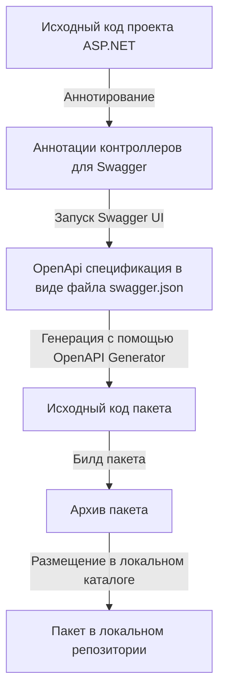

# Клиентская библиотека API, генерируемая на основе OpenApi спецификации

Библиотека формируется на основе исходного кода ASP.NET проекта. Используется как middleware пакет во Vue проекте.

Концептуально последовательность следующая:



## Быстрый старт
1. Запустить `generate-pckg.bat`.
2. Настроить `config.ps1` для конкретной машины.
3. Запустить скрипт повторно для генерации пакета.

## Требования
- Windows с PowerShell.
- Доступ к удаленной Linux машине (Astra Linux).
- Установленный Docker на Linux машине.
- SSH доступ к Linux машине.

## Подготовка пакета
Для генерации пакета используется спецификация OpenApi. Она формируется инструментом Swagger в ASP.NET проекте.
Файл спецификации формируется с помощью Swagger UI.
Файл спецификации передается на вход утилите [openapi-generator](https://openapi-generator.tech/) ([github](https://github.com/OpenAPITools/openapi-generator)).
Утилита формирует исходный код пакета.
Пакет собирается в архив и размещается в локальном репозитории.

## Настройка SSH доступа
Ряд действий выполняется на удаленной машине, что требует `ssh` доступа. По умолчанию пароль будет запрошен много раз (на каждую команду). Чтобы избежать такого поведения рекомендуется использовать RSA ключи.
Генерация ключей:
```powershell
ssh-keygen -t rsa -b 4096
```
Пара ключей сохранится в каталог `C:\Users\user\.ssh` (здесь `user` - это имя пользователя):
- приватный: `id_rsa`
- публичный: `id_rsa.pub`

```powershell
cd C:\Users\user\.ssh
type .\id_rsa.pub
```
Скопировать вывод. Подключиться:
```shell
ssh administrator@192.168.100.99
```
Ввести пароль. Далее команды:
```shell
mkdir -p ~/.ssh
chmod 700 ~/.ssh
echo "ВАШ_ПУБЛИЧНЫЙ_КЛЮЧ" >> ~/.ssh/authorized_keys
chmod 600 ~/.ssh/authorized_keys
```
Вместо строки `"ВАШ_ПУБЛИЧНЫЙ_КЛЮЧ"` - вывод команды `type` из предыдущего пункта (без кавычек). Теперь выполнение скриптов будет происходить без запроса пароля.

## Особенности утилиты openapi-generator
Для упрощения работы с openapi-generator используется версия в [Docker-контейнере](https://hub.docker.com/r/openapitools/openapi-generator-cli). Из-за конфликта WSL и Virtual Box контейнер запускается на удаленной машине с Astra Linux. Поэтому действия, непосредственно связанные с генерацией, выполняются удаленно по `ssh`.

## Версионирование
Каждый новый билд пакета инкрементирует мажорную версию. Исходная версия берется из манифеста `package.json` до генерации новой версии пакета. После генерации и копирования файлов скрипт заменяет версию непосредственно в файле `package.json`. Изменяется именно мажорная версия, т.к. после регенерации пакета API как правило не совместим с предыдущей версией.
Пример: `1.2.3 → 2.0.0`.

## Сборка пакета
Скрипт формирует файл вида `kdepa-api-middleware-1.0.0.tgz`, который будет расположен в каталоге, указанном в параметре `Paths.LocalPackageRepository` конфигурационного файла `config.ps1`. Этот файл можно использовать как пакет в командах `npm` или в файле `package.json`. Пример использования:
```json
{
    "dependencies": {
        "kdepa-api-middleware": "file:../../.packages-local-repository/npm/kdepa-api-middleware-1.0.0.tgz",
    }
}
```

## Скрипты автоматизации
В каталоге `scripts` расположен ряд скриптов, используемых для автоматизации процесса.

### Linux скрипты
В подкаталоге `linux` расположены скрипты, которые должны быть размещены и выполнены на удаленной linux-машине:
- `run_ext.sh` - стартовый скрипт, который вызывается из внешнего мира.
- `clear.sh` - скрипт, очищающий рабочий каталог (за исключением указанных в его исключениях файлов). Запускается из `run_ext.sh`.
- `generate-api.sh` - скрипт, непосредственно вызывающий утилиту генерации пакета. Запускается из `run_ext.sh`.

#### generate-api.sh
Скрипт `generate-api.sh` запускает docker-контейнер, который использует файл спецификации `swagger.json` и генерирует пакет в выходной каталог `/out/js`.

Параметры:
- `--user $(id -u):$(id -g)` - запуск контейнера от имени текущего пользователя (а не root), где `id -u` получает ID текущего пользователя, `id -g` - получает ID группы текущего пользователя.
- `--rm` - автоматически удаляет контейнер после завершения работы.
- `-v "${PWD}:/local"` - монтирует текущую директорию хоста в /local внутри контейнера.
- `openapitools/openapi-generator-cli generate` - запускает генерацию из образа OpenAPI Generator.
- `-i /local/swagger.json` - входной файл со спецификацией OpenAPI.
- `-g javascript` - генерировать код для JavaScript.
- `-o /local/out/js` - выходная директория для сгенерированного кода.
- `--package-name "kdepa-api-middleware"` - название пакета для сгенерированного кода.
- `--additional-properties usePromises=true` - использовать Promises вместо callback'ов в сгенерированном коде.

#### Права доступа
Скрипты должны быть заранее вручную скопированы на удаленную linux машину в каталог, указанный в `config.ps1` в параметре `Server.WorkFolder`. Скриптам должны быть предоставлены права на выполнение для того пользователя, от имени которого они выполняются.

### Windows скрипты
- `generate-pckg.ps1` - основной скрипт.
- `generate-pckg.functions.ps1` - прикладные параметризуемые функции скрипта.
- `generate-pckg.bat` - bat-обертка для `generate-pckg.ps1`.
- `config.template.ps1` - шаблон настроек для скрипта. На его основе формируется файл конфигурации `config.ps1`.
- `config.ps1` - файл конфигурации.

#### Файл конфигурации
Файл конфигурации `config.ps1` создается для указания параметров, зависимых от конкретной машины. Не добавляется в отслеживание `git` (добавлен в `.gitignore`). Формируется автоматически при первом запуске `generate-pckg.ps1`. Он создается как копия файла `config.template.ps1`. При создании в файле содержится параметр `NotChangedFlag = $true`. Параметр должен быть удален или его значение изменено на `$true`. Иначе скрипт не выполнится.

## Прочие каталоги
Для временных файлов используется каталог `_tmp`. Он добавлен к игнорируемым в git.
Для размещения архивов пакета по умолчанию используется каталог `npm`. Он также добавлен к игнорируемым в git. Рекомендуется указать каталог, в котором расположены прочие локальные пакеты.

## GitHub workflow
В проекте реализован CI/CD на основе GitHub Actions. При любых push запускается сборка.

При добавлении тега в формате `v*.*.*` (например, `v2.0.0`) происходит сборка и публикация пакета в репозиторий пакетов GitHub, связанный с репозиторием пакета.

Нужно обратить внимание, что версия, указанная в теге, не связана с версией, указанной в `package.json`. Пакет, который кладется в репозиторий пакетов GitHub, берет версию из `package.json`.

### Установка из репозитория пакетов GitHub
Для установки пакета нужно войти в аккаунт GitHub (если репозиторий приватный):
```bash
npm login --scope=@andrey-aka-skif --registry=https://npm.pkg.github.com --auth-type=legacy
```
где:
- `@andrey-aka-skif` - аккаунт на github;
- ``--auth-type=legacy`` - способ авторизации на основе токенов старого образца;

Далее потребуется последовательно ввести:
- имя аккаунта GitHub `andrey-aka-skif`
- токен доступа: `ghp_github_token`
- e-mail, связанный с аккаунтом: `account-e-mail@gmail.com`

Далее установить пакет средствами npm:
```bash
npm install @andrey-aka-skif/kdepa-api-middleware
```

## TODO
Рекомендуется рассмотреть вариант использования локального репозитория пакетов, основанного на gitea.
